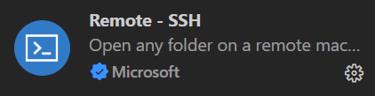
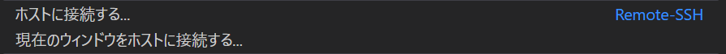
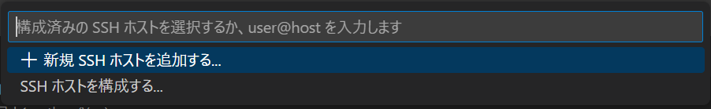

# 山川研究室卒業研究引継ぎ

## 目次

* [Jetson Nanoについて](#jetson-nanoについて)
* [プログラムの書き方](#プログラムの書き方)
* [Dockerについて](#dockerについて)
* [VScodeで接続する方法](#VScodeで接続する方法)
* [Jetson-inferenceについて](#jetson-inferenceについて)
* [困ったとき](#困ったとき)

## Jetson Nanoについて

<a name="jetson-nanoについて"></a>

* 環境  
  OS : Ubuntu Linux  
  Version : 18.04.6 LTS (Bionic Beaver)  
  Docker Version : 20.10.12

* Jetson Nano起動方法
  * パスワードは```jetson```と入力すれば開きます

* [ターミナル](https://qiita.com/happa-creator/items/da814a15f1b3b237eb79)の開き方
  * 以下のアイコンをクリックすると開きます  
    

## プログラムの書き方

<a name="プログラムの書き方"></a>

* vimの起動方法
  * vimコマンドの引数にファイル名を付ける

  ```shell
  jetson@jetson-desktop:~$ vim makerun.sh
  ```

  そして`i`を押すと書き込めるようになる

* エディタ画面からの出方
  * `Esc`を押し`:wq`と入力しエンターを押せばセーブしてでられる(`:`はキーボードによっては`Shift` + `;`で出る)

## Dockerについて

<a name="dockerについて"></a>

* Dockerの使い方
  * `docker images`とコマンドをうつとimage一覧が表示されます

  ```shell
  jetson@jetson-desktop:~$ docker images
  ```

  * ターミナルを開いたら[ホームディレクトリ](https://qiita.com/eee_eee/items/3bfc9ba935b2ec1e85d0)が開かれるので、そこに`makerun.sh`があるので引数にREPOSITORYとTAGを付けて実行します  
    `makerun.sh`の見方

    ```shell
    jetson@jetson-desktop:~$ cat makerun.sh
    ```

    書き方はREPOSITORY:TAGの形  
    実行例

    ```shell
    jetson@jetson-desktop:~$ ./makerun.sh mint
    ```

    ```shell
    jetson@jetson-desktop:~$ ./makerun.sh dustynv/jetson-inference:r32.4.4
    ```
  
    するとコンテナが起動し、コンテナ内に入ります

    コンテナから出るには`exit`と入力します

    ```shell
    root@jetson-desktop:/jetson-inference# exit
    ```

  * 参考にしたサイト  
  <https://qiita.com/k5n/items/2212b87feac5ebc33ecb>

## VScodeで接続する方法

<a name="VScodeで接続する方法"></a>

* ssh接続を用いて接続する
  * まずは拡張機能から[Remote-SSH](https://marketplace.visualstudio.com/items?itemName=ms-vscode-remote.remote-ssh)を入れる

  拡張機能  
  

  Remote-SSH  
  

  左下のこのマークを押し、ホストに接続するを選択する

  

  ホストに接続する
  

  SSHホストを構成する
  

  以下の文を追加する

  ```config
  Host jetson-desktop
    HostName jetson-desktop
    User jetson
  ```

## Jetson-inferenceについて

<a name="jetson-inferenceについて"></a>

* Github  
  <https://github.com/dusty-nv/jetson-inference>

* たくさんのimageを制作してしまい安定したバージョンが存在しない現状それぞれのコンテナ毎に対応が異なる  
  そのためホームディレクトリにあるshell scriptを見て操作してほしい

## 困ったとき

<a name="困ったとき"></a>

* おまじない
  * 上手くどうさしないとき  
    以下のコマンドを実行する

    ```shell
    sudo apt-get update
    sudo apt-get upgrade
    ```

  * 止まらなくなったとき  
    `Ctrl`+`C`を連打する

* わからないとき
  * Googleで検索する
  * 私に連絡するとき
  Discord : minto1563
